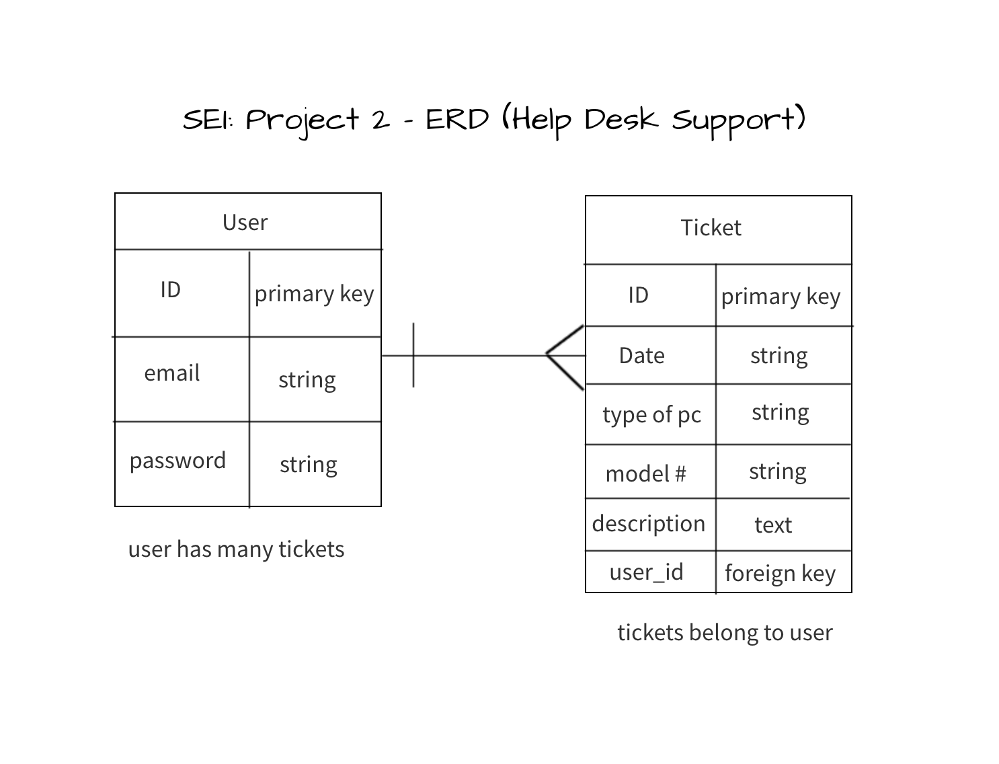
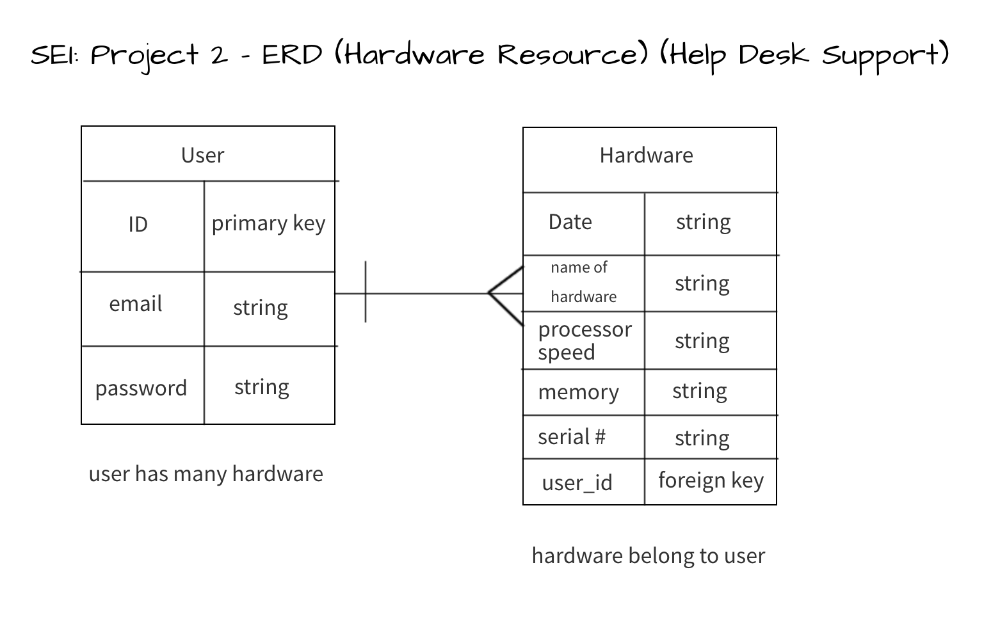

# **Project 2: Help Desk Support (API)**

This part of project 2 will be the API.

# **Description**
This side of the project will be the backend where an API will be created from scratch and deployed to Heroku. This side will hold all the data like the database and its tables.

# **User Stories For Ticket Resource**

- As a user I want to be able to sign-up successfully.

- As a user I want to be able to sign-in successfully.

- As a user I want to be able to create a ticket successfully.

- As a user I want to be able to update a ticket successfully.

- As a user, I want to be able to view all tickets successfully.

- As a user, I want to be able to remove a ticket successfully.

- As a user, I want to be able to change the password successfully.

- As a user, I want to be able to sign-out successfully.

# **User Stories For Hardware Resource**

- As a user I want to be able to sign-up successfully.

- As a user I want to be able to sign-in successfully.

- As a user I want to be able to create a hardware successfully.

- As a user I want to be able to update a hardware successfully.

- As a user, I want to be able to view all hardware successfully.

- As a user, I want to be able to remove a hardware successfully.

- As a user, I want to be able to change the password successfully.

- As a user, I want to be able to sign-out successfully.

# **Technologies Used**
- Heroku

- PostgresSQL

- Ruby

- Ruby on Rails

# **Client Side Repository**
- Link to the API side repo: [API Side Repository](https://github.com/Nancy4510/project2_api)

- Link to the client side repo: [Client Side Repository](https://github.com/Nancy4510/project2_client)

- Link to the deployed back-end: [Deployed Back-End](https://peaceful-cove-13394.herokuapp.com)

- Link to the deployed site: [Help Desk Support](https://nancy4510.github.io/project2_client/)

# **Entity Relationship Diagram For Ticket (ERD)**

# **Entity Relationship Diagram For Hardware (ERD)**

